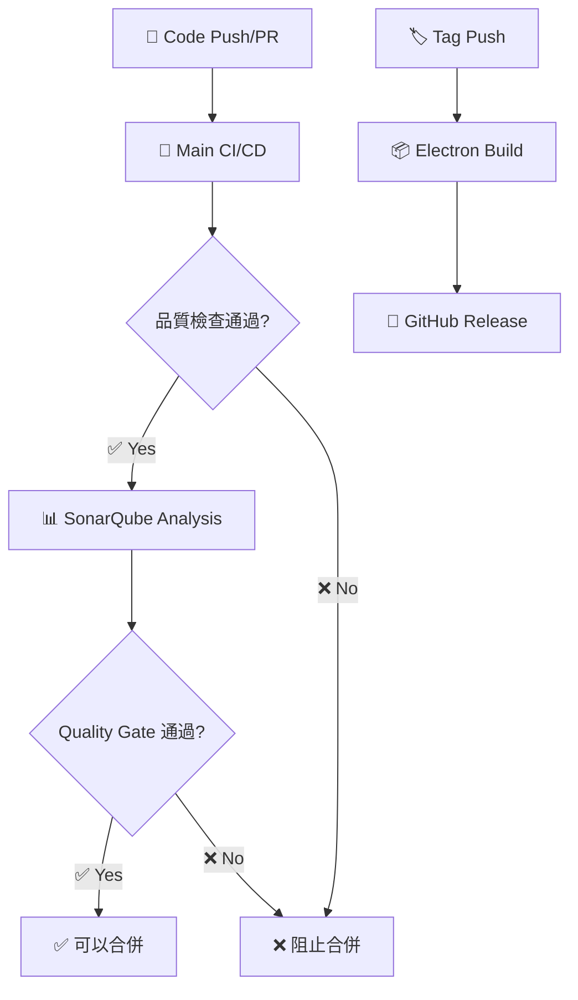

# GitHub Actions Workflows 文檔

## 🎯 **整理後的工作流程架構**

本專案採用清晰分工的工作流程架構，避免重複執行，提高 CI/CD 效率。

### 📊 **工作流程總覽**

| 工作流程                  | 觸發條件          | 主要功能                 | 執行時間    | 狀態        |
| ------------------------- | ----------------- | ------------------------ | ----------- | ----------- |
| 🚀 **Main CI/CD**         | Push/PR           | 完整品質檢查、測試、建構 | ~5-8 分鐘   | ✅ 主要流程 |
| 📊 **SonarQube Analysis** | PR 或主流程完成後 | 程式碼品質分析           | ~3-5 分鐘   | ✅ 品質保證 |
| 📦 **Electron Release**   | Tag 推送          | 跨平台應用建構和發布     | ~15-20 分鐘 | ✅ 發布流程 |

---

## 🚀 **Main CI/CD Pipeline** (`main.yml`)

### 🎯 **用途**

主要的持續整合和部署流程，確保每次程式碼變更都經過完整的品質檢查。

### ⚡ **觸發條件**

```yaml
# 推送到主要分支
push:
  branches: [main, develop]
  paths-ignore: ['**.md', 'docs/**']

# Pull Request
pull_request:
  branches: [main, develop]
  paths-ignore: ['**.md', 'docs/**']
```

### 📋 **執行階段**

#### 1️⃣ **Quality Gate** (必要階段)

```bash
🎨 ESLint 檢查
🔍 TypeScript 類型檢查
🧪 單元測試 + 覆蓋率
📊 Codecov 覆蓋率上傳
🏗️ 應用程式建構
📦 建構產物快取
```

#### 2️⃣ **E2E Tests** (條件執行)

```bash
條件：
- Push to main branch (總是執行)
- PR 中有重要檔案變更 (智慧偵測)

執行：
🎭 Playwright 依賴安裝
🧪 端對端測試
📊 測試報告上傳
```

#### 3️⃣ **Security Scan** (平行執行)

```bash
🔍 npm audit 安全檢查
🔒 CodeQL 程式碼分析
🛡️ GitHub Security 整合
```

#### 4️⃣ **CI Success** (狀態匯總)

```bash
📊 所有階段狀態檢查
✅ 成功/失敗狀態報告
🎉 完成通知
```

### 🔧 **特色功能**

- **智慧 E2E 執行**: 只在必要時執行 E2E 測試
- **並行處理**: Security scan 與其他流程並行
- **快取優化**: 建構產物快取提高效率
- **詳細狀態報告**: 清楚的成功/失敗反饋

---

## 📊 **SonarQube Code Analysis** (`sonar.yml`)

### 🎯 **用途**

專門負責程式碼品質分析，與主 CI 流程解耦，避免重複執行基本檢查。

### ⚡ **觸發條件**

```yaml
# 主 CI 完成後執行 (避免重複)
workflow_run:
  workflows: ['🚀 Main CI/CD Pipeline']
  types: [completed]
  branches: [main, develop]

# PR 立即反饋
pull_request:
  branches: [main, develop]
```

### 📋 **執行階段**

#### 1️⃣ **準備階段**

```bash
📂 程式碼檢出 (深度克隆)
🔧 Node.js 環境設定
📦 依賴安裝
🧪 生成測試覆蓋率報告
```

#### 2️⃣ **SonarQube 分析**

```bash
📊 程式碼品質掃描
⏳ Quality Gate 檢查 (10 分鐘超時)
📊 詳細狀態報告
❌ 失敗處理和建議
```

#### 3️⃣ **PR 整合**

```bash
💬 智慧 PR 評論 (更新現有評論)
📊 詳細分析結果展示
🔗 SonarCloud 連結
🛠️ 修復建議
```

### 🎯 **Quality Gate 設定**

- **覆蓋率門檻**: 10% (開發友好)
- **新程式碼**: 重點關注品質
- **安全性**: 零容忍政策
- **可維護性**: 適度要求

---

## 📦 **Electron App Release Build** (`build-electron-app.yml`)

### 🎯 **用途**

負責跨平台 Electron 應用程式的建構和發布，只在發布時執行。

### ⚡ **觸發條件**

```yaml
# 版本標籤推送
push:
  tags: ['v*']

# 手動觸發 (測試用)
workflow_dispatch:
  inputs:
    draft_release: true/false
```

### 📋 **執行階段**

#### 1️⃣ **Pre-build Checks** (品質保證)

```bash
🧪 單元測試執行
🏗️ 建構測試
✅ 發布前品質確認
```

#### 2️⃣ **Cross-platform Build** (並行建構)

```bash
Platform Matrix:
🪟 Windows (x64) - Windows installer + portable
🍎 macOS (Universal) - DMG disk image
🐧 Linux (x64) - AppImage + deb + rpm

每個平台：
📦 依賴安裝
🍎 macOS 程式碼簽名 (如可用)
🏗️ Web 應用建構
📦 Electron 應用打包
📤 建構產物上傳
```

#### 3️⃣ **GitHub Release** (自動發布)

```bash
📥 下載所有建構產物
📝 自動生成 Release Notes
🚀 建立 GitHub Release
📦 附加所有平台的安裝包
```

### 🔧 **進階功能**

- **Universal macOS**: 支援 Intel 和 Apple Silicon
- **多格式 Linux**: AppImage, deb, rpm 多種格式
- **自動簽名**: macOS 程式碼簽名支援
- **智慧 Release**: 根據版本號自動判斷 pre-release

---

## 🔄 **工作流程互動關係**

### 📊 **執行順序**



### 🎯 **避免重複執行**

- **Main CI** 負責基本品質檢查
- **SonarQube** 只在 Main CI 完成後執行，避免重複
- **Electron Build** 只在發布時執行

### ⚡ **效率優化**

- **路徑過濾**: 忽略文檔變更
- **並行執行**: Security scan 與主流程並行
- **智慧快取**: 建構產物和依賴快取
- **條件執行**: E2E 測試智慧觸發

---

## 🛠️ **本地測試與除錯**

### 📋 **模擬 CI 環境**

```bash
# 模擬 Main CI 流程
npm run quality:check

# 模擬 SonarQube 檢查
npm run test:coverage
npm run sonar:scan

# 模擬 Electron 建構
npm run build:win   # Windows
npm run build:mac   # macOS
npm run build:linux # Linux
```

### 🔍 **常見問題排除**

#### Main CI 失敗

```bash
問題: ESLint 錯誤
解決: npm run lint:fix

問題: TypeScript 錯誤
解決: 檢查型別定義

問題: 測試失敗
解決: npm run test:unit --watch

問題: 建構失敗
解決: npm run build --verbose
```

#### SonarQube 問題

```bash
問題: Quality Gate 失敗
解決: 檢查 SonarCloud 儀表板

問題: 覆蓋率不足
解決: npm run test:coverage 查看報告

問題: 複雜度過高
解決: 重構複雜函數
```

#### Electron 建構問題

```bash
問題: 跨平台建構失敗
解決: 檢查 electron-builder 設定

問題: 簽名失敗 (macOS)
解決: 檢查憑證設定

問題: 依賴問題
解決: npm ci && npm run postinstall
```

---

## 📈 **監控與維護**

### 📊 **關鍵指標**

- **Main CI 成功率**: 目標 >95%
- **平均執行時間**: 目標 <8 分鐘
- **E2E 測試執行頻率**: 主分支 100%，PR 智慧觸發
- **SonarQube Quality Gate 通過率**: 目標 >90%

### 🔧 **定期維護**

- **每月**: 檢查 Actions 版本更新
- **每季**: 評估工作流程效率
- **重大變更**: 測試所有工作流程

### 📝 **最佳實踐**

- **小步提交**: 減少 CI 失敗機率
- **本地測試**: 推送前運行 `npm run quality:check`
- **分支策略**: feature → develop → main
- **版本標籤**: 使用語義化版本 (v1.2.3)

---

## 🎉 **總結**

### ✅ **整理後的優勢**

- **🚀 效率提升**: 避免重複執行，平行處理
- **🛡️ 品質保證**: 分層檢查，全面覆蓋
- **📦 發布自動化**: 一鍵跨平台發布
- **🔍 可視化**: 清楚的狀態反饋和錯誤指引

### 🎯 **適用場景**

- **日常開發**: Main CI 提供快速反饋
- **程式碼審查**: SonarQube 提供品質洞察
- **版本發布**: Electron Build 自動化發布流程

這個整理後的工作流程架構為您的專案提供了**高效、可靠、易維護**的 CI/CD 體驗！ 🚀
